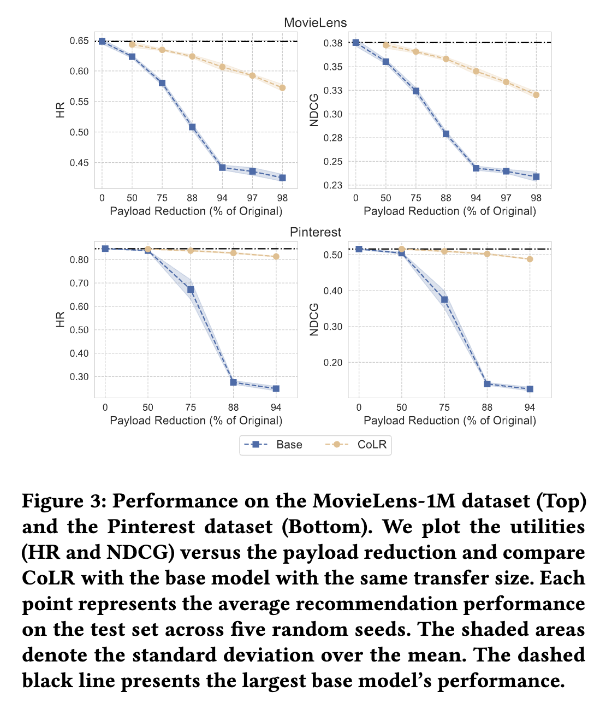

# Correlated Low-rank Structure (COLR) for Federated Recommendation System

This repository contains the code for the paper [Towards Efficient Communication Federated Recommendation System via Low-rank Training](). In this study, we propose a communication efficient framework for Federated Recommendation System.


## Requirements
* Python 3.9
* PyTorch 1.8.1
* hydra-core, hydra-colorlog

## Datasets
We included the datasets used in our experiments in the `dataset` folder. The datasets are preprocessed and split into training and testing sets. 

## Training
To train the model in the federated learning setting, run the following command:
```sh
python fedtrain.py data=ml-1m net=fedmf TRAIN.lr=0.5 FED.agg_epochs=2000 TRAIN.weight_decay=5e-4 TRAIN.log_interval=10 EVAL.interval=100
```

You can also use the `TRAIN.wandb=True` flag to log the training process to wandb. During training, we evaluate the model on the test set every `EVAL.interval` iterations. The evaluated metrics are HR and NDCG.

## Main results in the paper

| CoLR vs the base model             |  CoLR vs SVD, TopK |
:-------------------------:|:-------------------------:
  |  

### MovieLens-1M
To reproduce the results on MovieLens-1M, run the following command:
```sh
# FedMF base model
python fedtrain.py -m data=ml-1m net=fedmf net.init.gmf_emb_size=1,2,4,8,16,32,64 TRAIN.log_interval=10 EVAL.interval=100

# FedMF + SVD
python fedtrain.py -m data=ml-1m net=fedmf_svd net.init.gmf_emb_size=64 TRAIN.log_interval=10 EVAL.interval=100 compresor=svd net.compresor.rank=1,2,4,8,16,32

# FedMF + TopK
python fedtrain.py -m data=ml-1m net=fedmf_topk net.init.gmf_emb_size=64 TRAIN.log_interval=10 EVAL.interval=100 compresor=topk net.compresor.ratio=0.015625,0.03125,0.0625,0.125,0.25,0.5

# FedMF + CoLR
python fedtrain.py -m data=ml-1m net=fedmf_colr net.init.gmf_emb_size=64 net.init.rank=1,2,4,6,16,32 TRAIN.log_interval=10 EVAL.interval=100
```

### Pinterest
To reproduce the results on Pinterest, run the following command:
```sh
# FedMF base model
python fedtrain.py -m data=pinterest net=fedmf net.init.gmf_emb_size=1,2,4,8,16 TRAIN.log_interval=10 EVAL.interval=100

# FedMF + SVD
python fedtrain.py -m data=ml-1m net=fedmf_svd net.init.gmf_emb_size=64 TRAIN.log_interval=10 EVAL.interval=100 net.compresor.rank=1,2,4,8

# FedMF + TopK
python fedtrain.py -m data=ml-1m net=fedmf_topk net.init.gmf_emb_size=64 TRAIN.log_interval=10 EVAL.interval=100 compresor=topk net.compresor.ratio=0.0625,0.125,0.25,0.5

# FedMF + CoLR
python fedtrain.py -m data=pinterest net=fedmf_colr net.init.gmf_emb_size=16 net.init.rank=1,2,4,8 TRAIN.log_interval=10 EVAL.interval=100
```

### Homomorphic Encryption

| Method | Client overheads | Server overheads | Ciphertext size | Plaintext size | Comm Ratio |
|---|---:|---:|---:|---:|---:|
| FedMF | 0.93 s | 2.39 s | 24,587 KB | 927 KB | 26.52 |
| FedMF w/ TopK@1/64 | 88.20 s | 88.06 s | 3,028 KB | 29 KB | 103.09 |
| FedMF w/ TopK@2/64 | 182.02 | 185.59 | 6,056 KB | 58 KB | 103.83 |
| FedMF w/ TopK@4/64 | 353.25 | 364.67 | 12,112 KB | 116 KB | 104.20 |
| FedMF w/ TopK@8/64 | 723.45 | 750.98 | 24,225 KB | 232 KB | 104.40 |
| FedMF w/ TopK@16/64 | 1449.90 | 1483.91 | 48,448 KB | 464 KB | 104.49 |
|---|---|---|---|---|---|
| FedMF w/ CoLR@1 | 0.07 | 0.24 | 3,073 KB | 15 KB | 206.31 |
| FedMF w/ CoLR@2 | 0.07 | 0.25 | 3,073 KB | 29 KB | 104.63 |
| FedMF w/ CoLR@4 | 0.07 | 0.25 | 3,073 KB | 58 KB | 52.69 |
| FedMF w/ CoLR@8 | 0.08 | 0.25 | 3,073 KB | 116 KB | 26.44 |
| FedMF w/ CoLR@16 | 0.15 | 0.51 | 6,147 KB | 232 KB | 26.49 |
| FedMF w/ CoLR@32 | 0.30 | 1.03 | 12,293 KB | 464 KB | 26.51 |

We implement the homomorphic encryption scheme based on [OpenFHE]().

## Citation
If you find this repository useful in your research, please cite our paper:
```
